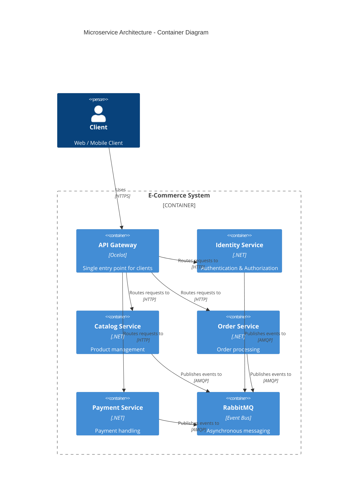

# Microservices.ECommerce

Production-grade microservices e-commerce backend with Clean Architecture, DDD, CQRS-style handlers (MediatR), RabbitMQ integration events, PostgreSQL per service, and an API Gateway (Ocelot).

---

## Türkçe

### Genel Bakış

Bu proje; mikroservis mimarisinde, event-driven iletişim kuran, bağımsız veri tabanlarına sahip servislerden oluşan bir e‑ticaret backend’idir. Amaç, mimari kararların net olduğu, teknik derinliği gösteren bir örnek sunmaktır.


### Mimari




### Hızlı Kurulum (Docker)

```bash
cd Microservices.ECommerce
copy .env.example .env
# .env içindeki JWT_KEY ve secret değerlerini isteğe göre değiştirin

docker compose up -d --build
```

API Gateway:
- `http://localhost:8080`

RabbitMQ Management:
- `http://localhost:15672` (guest/guest)

### Servisler

- **IdentityService**: kullanıcı kaydı, login, JWT, refresh token
- **CatalogService**: kategori/ürün/stock/variant yönetimi
- **OrderService**: sepet ve sipariş yaşam döngüsü
- **PaymentService**: ödeme simülasyonu (random success/fail)
- **ApiGateway (Ocelot)**: tek giriş noktası, routing ve auth enforcement

### Mimari Kararlar (Özet)

- **Database per service**: Her servis kendi PostgreSQL’ini yönetir.
- **Clean Architecture + DDD**: Domain katmanı izole; Application katmanı MediatR handler’ları ile orkestre edilir.
- **Event-driven integration**: RabbitMQ topic exchange, routing key = event class name.
- **At-least-once delivery**: consumer başarılı olursa `Ack`, hata olursa `Nack` + `requeue`.
- **CQRS yaklaşımı**: Commands/Queries ayrımı handler seviyesinde uygulanır.

Daha fazla detay: `docs/ARCHITECTURE.md`

### Event Akışı

```
IdentityService -> UserRegisteredEvent -> (subscriber yok)
CatalogService  -> ProductCreatedEvent  -> (subscriber yok)
OrderService    -> OrderCreatedEvent    -> PaymentService
PaymentService  -> PaymentCompletedEvent / PaymentFailedEvent -> OrderService
```

### Sağlık Kontrolü

Her servis `/health` endpoint’i sunar. Gateway üzerinden:
```
GET http://localhost:8080/health
```

### Swagger

Gateway üzerinden swagger toplayıcı:
```
http://localhost:8080/swagger
```

### RabbitMQ Test Script

Script tüm akışı (register → order → payment → order status) doğrular:

```powershell
cd Microservices.ECommerce
.\scripts\rabbitmq-test.ps1
```

### Postman

`docs/postman_collection.json` güncellenmiştir. Gateway üzerinden test eder.

### Örnek Senaryo (Ürün → Sipariş → Ödeme)

1. Kullanıcı register/login ile token alır.
2. (Admin) kategori ve ürün oluşturur.
3. Sepete ürün ekler.
4. Sipariş oluşturur → `OrderCreatedEvent`.
5. PaymentService event’i işler ve `PaymentCompletedEvent` veya `PaymentFailedEvent` yayınlar.
6. OrderService event’i tüketir ve statüyü **Paid/Failed** yapar.

### Rol Yönetimi

- **Register** Tüm kullanıcılar **User** rolüyle açılır.
- **Admin ataması** sadece Admin token ile yapılır:

```
POST /api/auth/users/{userId}/role
{ "role": "Admin" }
```

### Admin Bootstrap (Dev)

İlk Admin kullanıcıyı oluşturmak için bir bootstrap endpoint’i vardır. Bu endpoint **sadece** `AdminBootstrap__Secret` ile çalışır ve **ilk Admin** oluşturulduktan sonra kapalı hale gelir.

```
POST /api/auth/bootstrap-admin
{
  "email": "admin@example.com",
  "password": "Pass123!",
  "secret": "dev-admin-secret"
}
```

### Ortam Değişkenleri

Örnek env dosyası: `Microservices.ECommerce/.env.example`

RabbitMQ ayarları `RabbitMq__*` olarak env’den override edilebilir. Docker Compose her servis için `ServiceName` değerini ayrı ayrı set eder.

Örnek:

```
RabbitMq__HostName=rabbitmq
RabbitMq__Port=5672
RabbitMq__UserName=guest
RabbitMq__Password=guest
RabbitMq__VirtualHost=/
RabbitMq__ExchangeName=microservices.exchange
RabbitMq__ServiceName=order-service
```

Admin bootstrap için:

```
AdminBootstrap__Secret=dev-admin-secret
```

---

## English

### Overview

This project is an e-commerce backend based on a microservice architecture, consisting of events-driven communication and services with independent databases. The aim is to present an example that demonstrates technical depth while clearly defining architectural decisions.

### Architecture


### Quick Start (Docker)

```bash
cd Microservices.ECommerce
copy .env.example .env
# Update JWT_KEY and secrets if needed

docker compose up -d --build
```

API Gateway:
- `http://localhost:8080`

RabbitMQ Management:
- `http://localhost:15672` (guest/guest)

### Services

- **IdentityService**: registration, login, JWT, refresh tokens
- **CatalogService**: categories, products, stock, variants
- **OrderService**: basket + order lifecycle
- **PaymentService**: payment simulation (random success/fail)
- **ApiGateway (Ocelot)**: single entry point, routing, auth enforcement

### Architectural Decisions (Summary)

- **Database per service**: each service owns its PostgreSQL schema.
- **Clean Architecture + DDD**: domain layer is isolated; application layer uses MediatR handlers.
- **Event-driven integration**: RabbitMQ topic exchange, routing key = event class name.
- **At-least-once delivery**: consumers `Ack` on success, `Nack` with requeue on error.
- **CQRS approach**: Commands/Queries separated at handler level.

See details in `docs/ARCHITECTURE.md`.

### Event Flow

```
IdentityService -> UserRegisteredEvent -> (no subscribers)
CatalogService  -> ProductCreatedEvent  -> (no subscribers)
OrderService    -> OrderCreatedEvent    -> PaymentService
PaymentService  -> PaymentCompletedEvent / PaymentFailedEvent -> OrderService
```

### Health Checks

Each service exposes `/health`. Via gateway:
```
GET http://localhost:8080/health
```

### Swagger

Aggregated swagger via gateway:
```
http://localhost:8080/swagger
```

### RabbitMQ Test Script

This script validates the full flow (register → order → payment → order status):

```powershell
cd Microservices.ECommerce
.\scripts\rabbitmq-test.ps1
```

### Postman

Use `docs/postman_collection.json` (gateway-based routes).

### Example Scenario (Product → Order → Payment)

1. User registers/logs in and receives JWT.
2. (Admin) creates categories/products.
3. Adds item to basket.
4. Creates order → `OrderCreatedEvent`.
5. PaymentService processes and publishes `PaymentCompletedEvent` or `PaymentFailedEvent`.
6. OrderService consumes the event and updates the order to **Paid/Failed**.

### Role Management

- **Register** All users start as **User**.
- **Admin promotion** requires an Admin token:

```
POST /api/auth/users/{userId}/role
{ "role": "Admin" }
```

### Admin Bootstrap (Dev)

There is a bootstrap endpoint for the first Admin user. It requires `AdminBootstrap__Secret` and is only allowed when no Admin exists.

```
POST /api/auth/bootstrap-admin
{
  "email": "admin@example.com",
  "password": "Pass123!",
  "secret": "dev-admin-secret"
}
```

### Environment Variables

Example env file: `Microservices.ECommerce/.env.example`

RabbitMQ settings can be overridden via `RabbitMq__*` env vars. Docker Compose sets `ServiceName` per service.

Example:

```
RabbitMq__HostName=rabbitmq
RabbitMq__Port=5672
RabbitMq__UserName=guest
RabbitMq__Password=guest
RabbitMq__VirtualHost=/
RabbitMq__ExchangeName=microservices.exchange
RabbitMq__ServiceName=order-service
```

For admin bootstrap:

```
AdminBootstrap__Secret=dev-admin-secret
```
